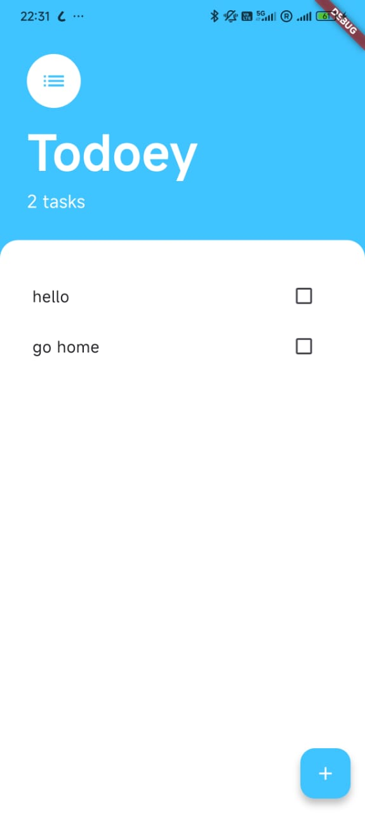
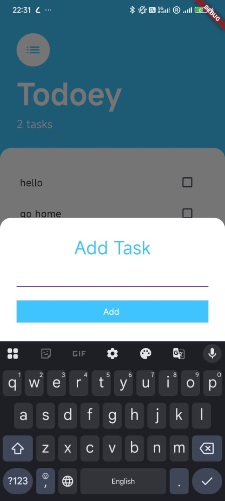

# Todoey App 📝

[](https://flutter.dev/) [](https://pub.dev/packages/provider) [](https://dart.dev/)

> A simple, clean, and customizable To-Do list app built with Flutter and Provider.

---

## 🚀 Table of Contents

- [📖 Overview](#-overview)
- [✨ Features](#-features)
- [📂 Folder Structure](#-folder-structure)
- [⚙️ Installation](#️-installation)
- [▶️ Running the App](#️-running-the-app)
- [🔧 Usage](#-usage)
- [🛠 Tech Stack](#-tech-stack)
- [🤝 Contributing](#-contributing)
- [📄 License](#-license)

---

## 📖 Overview

Todoey is a lightweight To-Do list application that helps you manage tasks with ease. Built with Flutter, it leverages the [Provider](https://pub.dev/packages/provider) package for simple and efficient state management. Whether you want to add new tasks, mark them as done, or delete completed ones, Todoey makes organizing your day a breeze.

---

## ✨ Features

- **Add Tasks:** Quickly add new tasks via a modal bottom sheet.
- **Mark as Done:** Toggle task completion status with a tap.
- **Delete Tasks:** Remove tasks with a long press.
- **Dynamic Count:** Live update of total tasks.
- **Clean UI:** Modern Material Design styling with customizable colors.

---

## 📂 Folder Structure

```plaintext
lib/
├── main.dart             # App entry point & Provider setup
├── models/
│   ├── task.dart         # Task model definition
│   └── tasks_data.dart   # ChangeNotifier & task list management
├── screens/
│   ├── tasks_screen.dart # Main tasks display & FAB
│   └── add_task_screen.dart # Bottom sheet to add a task
└── widgets/
    ├── tasks_list.dart   # ListView of tasks
    └── tasks_tile.dart   # Individual task ListTile widget
```

---

## ⚙️ Installation

1. **Prerequisites:**
   - [Flutter SDK](https://flutter.dev/docs/get-started/install) (>= 3.7.2)
   - Dart SDK (bundled with Flutter)
2. **Clone the repository:**
   ```bash
   git clone https://github.com/aarogyaojha/todoey.git
   cd todoey
   ```
3. **Install dependencies:**
   ```bash
   flutter pub get
   ```

---

## ▶️ Running the App

Connect a device or start an emulator, then:

```bash
flutter run
```

---


## 📸 Screenshots

_Add your app screenshots in the `screenshots/` directory and update the paths accordingly._

| Tasks Screen | Add Task Modal |
|--------------|----------------|
|  |  |


---
## 🔧 Usage

1. **Add a Task:** Tap the `+` FloatingActionButton, type your task, and press **Add**.
2. **Mark Complete:** Tap the checkbox next to a task to toggle its completion.
3. **Delete Task:** Long-press a task to remove it from your list.

---

## 🛠 Tech Stack

- **Flutter** — UI toolkit for building natively compiled applications.
- **Dart** — Programming language optimized for UI.
- **Provider** — State management solution.

---

## 🤝 Contributing

1. Fork the repo
2. Create your feature branch (`git checkout -b feature/YourFeature`)
3. Commit your changes (`git commit -m 'Add YourFeature'`)
4. Push to the branch (`git push origin feature/YourFeature`)
5. Open a Pull Request

Please ensure your commits follow the [Conventional Commits](https://www.conventionalcommits.org/) standard.

---

## 📄 License

This project is licensed under the **MIT License**. See the [LICENSE](LICENSE) file for details.

---

<sup>Made with ❤️ using Flutter and Provider</sup>


